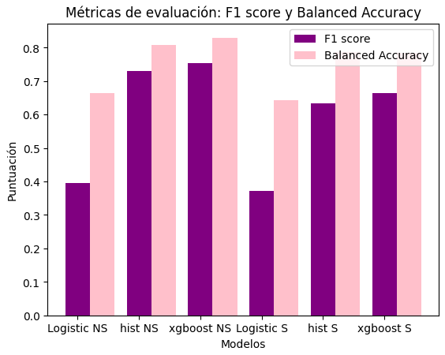

### Ruth Navarro Carrasco y Ángel José Mancha Núñez

# Attrition prediction model

The proyect´s aim is to predict the percentage of attrition of employees from companies based on information regarding their position, status and achievements.

This has been carried out using three different prediction models:
* `` Logistic Regression``: The logistic regression model fits the training data by minimizing a cost function that measures the discrepancy between the probabilities predicted by the model and the actual labels on the training data. Once the model has been fitted to the training data, it can be used to make predictions on new or previously unseen data.
* ``Histogram Gradient Boosting`` with hyper parameter tuning: This model works better in terms of precision or generalization capacity for this problem and also allows working with unbalanced problems, such as this one.
* `` Xgboost Gradient`` with hyper parameter tuning: It is a decision tree-based boosting algorithm that uses gradients to improve the accuracy of the predictions. The XGBoost approach combines the idea of boosting and regularization to reduce overfitting and improve the generalization of the model.

Furtheremore, it was considered interesting to perform a second round of annalysis studying the same prediction models but having performed an ``attribute selection`` method in order to predict the models just with the relevant features.

In order to establish which was the best model, three metrics for each prediction model were evaluated:

* ``f1_score``: combines precision and completeness into a single metric to assess the quality of a classification model.
* ``balanced_accuracy``: an evaluation metric that takes into account unbalanced classes in a data set.
* ``confusion_matrix``: a table showing the number of true positives, true negatives, false positives, and false negatives for a classification model.

# Conclusion

The graph shows all the data for both f1_score and balanced_accuracy. In model names, when there is *NS* it means that there has been no attribute selection and when *S* is included it means yes.

As can be seen in the graph, when there is a selection of attributes and when there is not, there is not a very noticeable improvement. Even so, it has been chosen the **``XGBOOST method with the selection of attributes``** since the result obtained for the measurements of F1_score and Balanced Accuacy, despite not being excessively better than that of the same model without the selection of attributes, manages to be very similar but also with the advantage of not having irrelevant attributes. 

